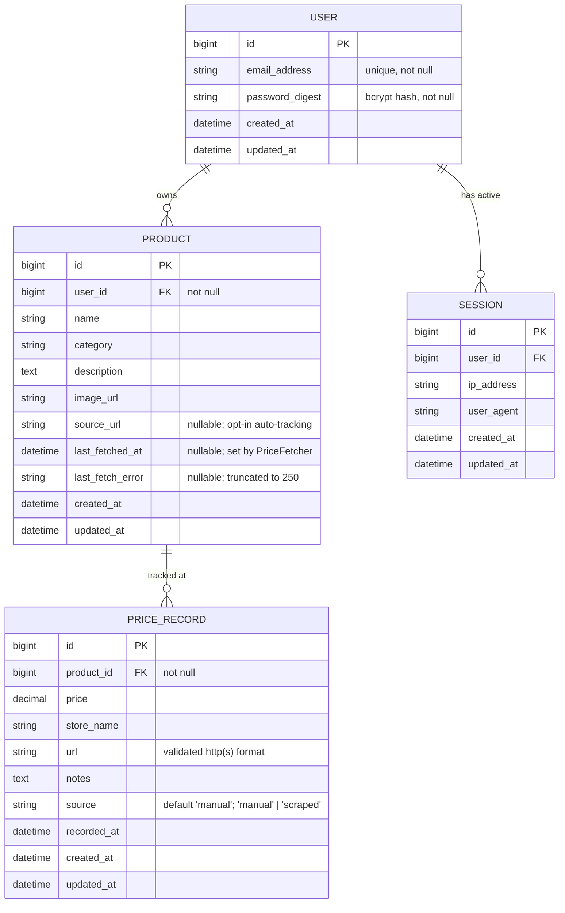
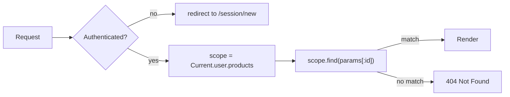
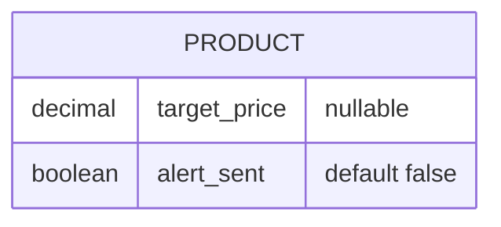
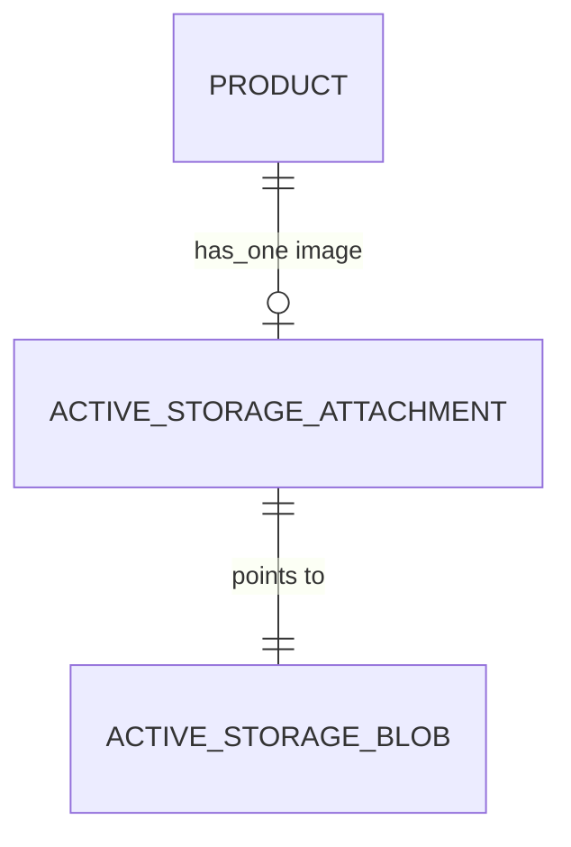
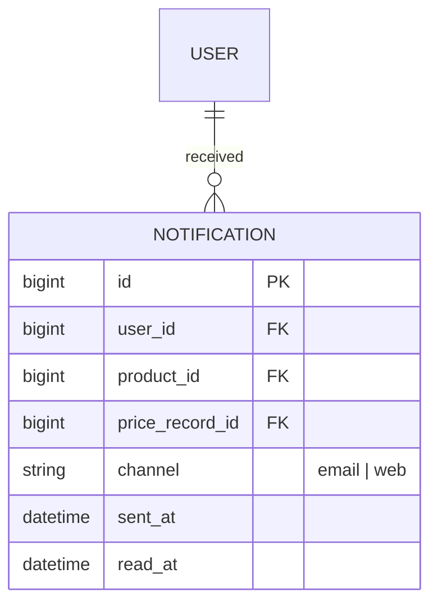
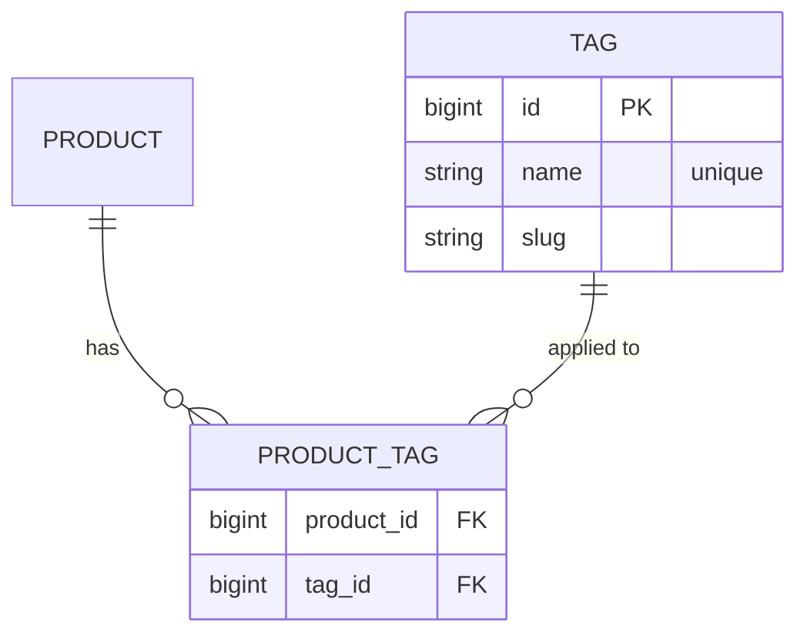
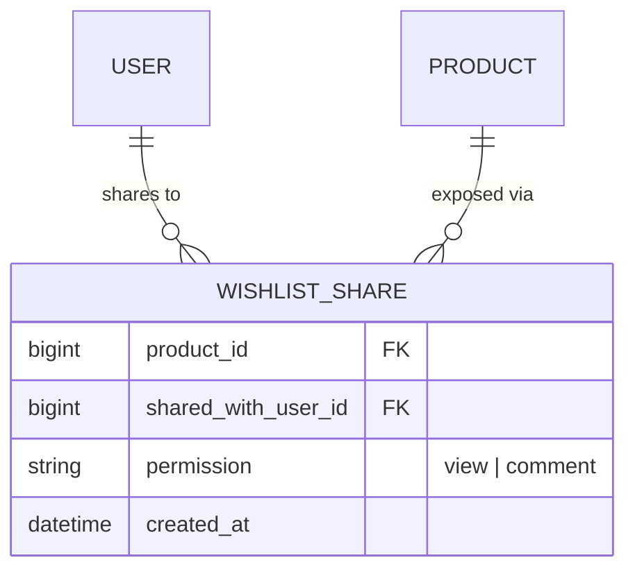

# Database & Entity-Relationship Reference

This document describes the current PriceTracker database schema, the relationships between models, and how the schema is expected to evolve as we build toward (and past) MVP.

---

## 1. Current schema (Milestone 0)

### Entity-relationship diagram



### Scraping fields (added in `AddScrapingFieldsToProductsAndPriceRecords`)

These columns are entirely additive and opt-in. A product with
`source_url IS NULL` behaves exactly as it did before this migration:
no automatic refresh, no "Fetch latest price" button. See
[scrapers.md](scrapers.md) for the full lifecycle.

| Column | Default | Set by |
|---|---|---|
| `products.source_url` | `NULL` | User, on the new-product form |
| `products.last_fetched_at` | `NULL` | `PriceFetcher.call` after a successful fetch |
| `products.last_fetch_error` | `NULL` | `PriceFetcher.call` when a `PriceScrapers::Error` is rescued |
| `price_records.source` | `"manual"` | `"manual"` for human-entered rows; `"scraped"` for rows created by `PriceFetcher` |

### Cardinality summary

| From → To | Cardinality | Meaning |
|---|---|---|
| User → Product | 1 ↔ many | A user owns any number of tracked products. |
| User → Session | 1 ↔ many | A user can be signed in on multiple devices/browsers. |
| Product → PriceRecord | 1 ↔ many | One product accumulates many observed prices over time. |

All "many" sides cascade-delete: deleting a user destroys their products and sessions; deleting a product destroys its price records.

---

## 2. Authorization model

Every product is **scoped to its owning user**. Controllers always query through `Current.user.products`, never `Product` directly. This means:

- A user listing products only sees their own.
- A user trying to access another user's product (`/products/:id`) gets a `404 Not Found` — not a `403`. This avoids leaking the existence of resources owned by other users.
- Price records inherit user scoping transitively through `product`. There is no `user_id` column on `price_records` because it's redundant — a price record's owner is implied by its product.



---

## 3. Validations

| Model | Field | Rule |
|---|---|---|
| User | `email_address` | normalized to lowercase + stripped, unique |
| User | `password` | required on create, bcrypt-hashed via `has_secure_password` |
| Product | `name` | presence required |
| Product | `category` | presence required |
| Product | `user_id` | implied by `belongs_to :user` (DB NOT NULL) |
| PriceRecord | `price` | presence + numericality, must be > 0 |
| PriceRecord | `store_name` | presence required |
| PriceRecord | `recorded_at` | presence; auto-filled with `Time.current` if blank |
| PriceRecord | `url` | optional; if present, must match `https?://...` |

---

## 4. Planned schema evolution

These changes are **not yet built**. They are organized in roughly the order we expect to implement them.

### 4.1 Target price + price-drop alerts

Add a `target_price` to products so users can flag a "buy at" threshold. When a new price record drops below it, eventually trigger a notification.



**Migrations:**
```ruby
add_column :products, :target_price, :decimal, precision: 10, scale: 2
add_column :products, :alert_sent,   :boolean, default: false, null: false
```

### 4.2 Purchased / archived state

A simple boolean toggle so users can mark items they've bought (or stopped tracking) and hide them from the active grid.

```ruby
add_column :products, :purchased_at, :datetime
# scope :active,    -> { where(purchased_at: nil) }
# scope :purchased, -> { where.not(purchased_at: nil) }
```

A nullable timestamp captures both "is it purchased?" and "when?" in one column — more flexible than a plain boolean.

### 4.3 Active Storage for product images

Replace the freeform `image_url` string with a real attachment so users can upload from their device.

```ruby
# in Product
has_one_attached :image
```

Active Storage adds two tables (`active_storage_blobs`, `active_storage_attachments`) automatically. Existing `image_url` rows get migrated to remote-pulled blobs or simply deprecated.



### 4.4 Notifications

When a `PriceRecord` is created with `price < product.target_price`, enqueue a background job to email the user (and optionally push a browser notification). Schema additions:



### 4.5 Tags / categories as first-class entities

Right now `category` is a free-text string on `products`. To support filtering and avoid typos like "Electronics" vs "electronic," promote categories (or general tags) to their own table with a join model.



### 4.6 Shared wishlists (later, if scoped in)

To let users share lists with others without giving up ownership, introduce a join model:



This keeps the strict per-owner authorization rule — sharing is opt-in metadata, not a change to ownership.

---

## 5. Anti-features (intentional non-changes)

A few things we explicitly **don't** plan to add, with reasoning:

| Idea | Why we're skipping |
|---|---|
| `user_id` on `price_records` | Redundant — derivable from `product.user_id`. Adds index churn and risk of inconsistency. |
| Roles / admins | MVP is single-tenant per user; no admin surface. |
| Soft-delete (`deleted_at`) on products | Not justified yet. Real deletes + cascading destroy is simpler and the data isn't business-critical. |
| Polymorphic price source | A `PriceRecord` is always tied to a `Product`. No need for polymorphism. |

---

## 6. How to update this doc

When you add or change a migration, update the relevant section above. Mermaid diagrams render natively on GitHub, so no extra tooling is needed — just edit the code blocks.
