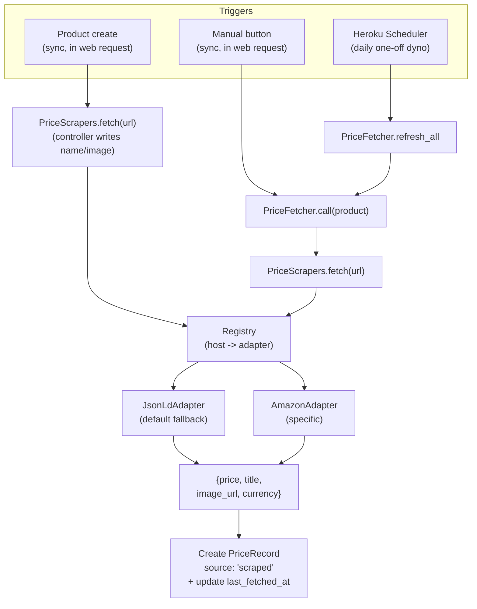

# 价格抓取（Phase 1）实施计划

## 设计原则

- **现有功能零改动**：不修改 [app/controllers/price_records_controller.rb](app/controllers/price_records_controller.rb) 现有动作，不改既有字段，不改既有视图的"手动加价"路径。
- **加法不减法**：新增的列都有默认值；旧数据 `source = "manual"`、`source_url = nil`，行为完全等同今天。
- **Adapter Pattern + Registry**：每个站点 = 一个独立类。新加站点 = 加一个文件，不动 controller/model。
- **失败不破事**：抓取失败只更新 `last_fetch_error`，不会让用户的页面挂掉。

## 现有假数据安全保证（opt-in 语义）

这一版是 **完全 opt-in** 的：不给 product 填 `source_url`，旧数据 100% 不变。具体守卫：

- `FetchPriceJob#perform` 第一行：`return if product.source_url.blank?`
- `Product` 的 `after_commit on: :create` 钩子带 `if: -> { source_url.present? }`
- `RefreshAllPricesJob` 用 `Product.where.not(source_url: nil).find_each`

抓取行为只**追加**新的 `PriceRecord(source: "scraped")`，**绝不 update / delete** 任何已存在的 price_record。旧的 manual 记录永远在那。

## 创建时的字段填充策略（决策已定）

创建 form 极简化为 **`source_url` + `category` 两个输入**。其他字段如下处理：

- **`name`**：完全由抓取结果填；抓不到 title 时用 `URI.host + path 最后一段` 兜底，保证 `validates :name, presence: true` 通过
- **`image_url`**：抓取拿到就用，没拿到就空
- **`description`**：创建时一律为空，用户想填在 edit 页加

**之后**任何抓取（手动按钮、每日定时）：
- **不动** `name` / `image_url` / `description` / `category`
- 只追加新的 `PriceRecord(source: "scraped")`，更新 `last_fetched_at` / `last_fetch_error`

判定逻辑很简单：因为只有 controller 的 `create` 会写 name/image，FetchPriceJob 根本不去碰这两列。这样：
- 用户日后在 edit 页改了 name/image → 永远不会被自动覆盖
- 网站改了图、改了标题 → 我们不会跟着变（这是好事，避免商家页面被改后用户的卡片突然变样）

## 架构图



注意：所有抓取**都是同步**的——要么在 web 请求生命周期内（用户点按钮），要么在 Heroku Scheduler 启动的临时 dyno 内。**没有 ActiveJob、没有 Solid Queue、没有常驻 worker dyno**。

## 1. 数据库迁移（全部 additive）

新文件 `db/migrate/<ts>_add_scraping_fields_to_products_and_price_records.rb`：

```ruby
class AddScrapingFieldsToProductsAndPriceRecords < ActiveRecord::Migration[8.1]
  def change
    add_column :products, :source_url,        :string
    add_column :products, :last_fetched_at,   :datetime
    add_column :products, :last_fetch_error,  :string
    add_index  :products, :source_url

    add_column :price_records, :source, :string, default: "manual", null: false
    add_index  :price_records, :source
  end
end
```

`docs/database.md` 第 1 节顺手补 ER 图，避免文档落伍。

## 2. Gemfile 改动

[Gemfile](Gemfile) 新增（`nokogiri` 已经是 Gemfile.lock 里的间接依赖，显式加进来我们就拥有了它）：

```ruby
gem "nokogiri"
gem "httparty"
```

**注意**：曾考虑过加 `solid_queue` 做后台队列，但因为我们选了"同步抓 + Heroku Scheduler"路线，**不需要任何后台队列 gem**。production.rb 里的 `queue_adapter = :async` 保持不变（反正我们也不 enqueue 任何东西）。

## 3. 新增 Service 层（核心）

新目录 `app/services/price_scrapers/`：

- `app/services/price_scrapers.rb` — 顶层 facade：`PriceScrapers.fetch(url)` 找 adapter 并调用，统一返回 `Result` 或 `Error`
- `app/services/price_scrapers/result.rb` — 简单的 Struct：`price, currency, title, image_url, fetched_at`
- `app/services/price_scrapers/error.rb` — 自定义异常基类
- `app/services/price_scrapers/base.rb` — 抽象基类，提供 `http_get(url, ua:)`、Nokogiri 解析、价格字符串清洗（`"$1,234.56"` → `BigDecimal`）等共用工具
- `app/services/price_scrapers/json_ld_adapter.rb` — **通用兜底**：抓 `<script type="application/ld+json">`，找 `@type == "Product"` 的节点，读 `offers.price`、`offers.priceCurrency`、`name`、`image`。覆盖 Best Buy / Target / Newegg / Apple / B&H / 大量小站
- `app/services/price_scrapers/amazon_adapter.rb` — **专用**：Amazon 的 JSON-LD 不稳，自己解 `#corePriceDisplay_desktop_feature_div .a-price .a-offscreen`、`#productTitle`、`#landingImage`；明确设置浏览器级 User-Agent；抓不到就只回 title/image，price 留空（让用户知道结果而不是崩溃）
- `app/services/price_scrapers/registry.rb` — 按 host 做查找，未命中走 `JsonLdAdapter`：

```ruby
module PriceScrapers
  class Registry
    ADAPTERS = {
      /(^|\.)amazon\.[a-z.]+$/ => AmazonAdapter
    }.freeze

    def self.for(url)
      host = URI.parse(url).host.to_s.downcase
      ADAPTERS.each { |re, klass| return klass.new if host.match?(re) }
      JsonLdAdapter.new
    end
  end
end
```

加新站点的"标准做法"：在 `ADAPTERS` 里加一行，或者干脆什么都不做（让 JsonLdAdapter 兜底），先看效果再决定要不要写专用。

## 4. PriceFetcher 服务（纯 PORO，非 ActiveJob）

新文件 `app/services/price_fetcher.rb`：

```ruby
class PriceFetcher
  def self.call(product)
    return if product.source_url.blank?
    result = PriceScrapers.fetch(product.source_url, timeout: 5)

    # Dedup: only write a new price_record if price actually changed since the
    # last scraped record. Lets us schedule as frequently as we want without
    # polluting the price history with thousands of identical rows.
    if result.price.present?
      last = product.price_records
                    .where(source: "scraped")
                    .order(recorded_at: :desc)
                    .first
      if last.nil? || last.price != result.price
        product.price_records.create!(
          price:       result.price,
          store_name:  result.store_name,
          url:         product.source_url,
          recorded_at: result.fetched_at,
          source:      "scraped"
        )
      end
    end

    # NOTE: never touches name / image_url / category / description here.
    # Those are only set during product creation in ProductsController#create.
    product.update_columns(last_fetched_at: Time.current, last_fetch_error: nil)
  rescue PriceScrapers::Error => e
    product.update_columns(last_fetch_error: e.message.truncate(250))
  end

  # Called by Heroku Scheduler. Two modes:
  #   refresh_all          — hit every tracked product (use when products are few)
  #   refresh_stale(2.days) — only those not fetched recently (use when scheduling
  #                          frequently or product list is large, to avoid waste)
  def self.refresh_all
    Product.where.not(source_url: nil).find_each { |p| call(p); sleep 1 }
  end

  def self.refresh_stale(min_age: 2.days)
    Product.where.not(source_url: nil)
           .where("last_fetched_at IS NULL OR last_fetched_at < ?", min_age.ago)
           .find_each { |p| call(p); sleep 1 }
  end
end
```

设计要点：
- **不是 ActiveJob**——就是个普通 Ruby 类，调用方直接 `PriceFetcher.call(product)`，**当场执行、当场返回**
- 失败被 rescue 住，**永远不会让调用它的 web 请求或 Scheduler 任务崩溃**——失败信息存到 `product.last_fetch_error`，UI 上显示给用户看

## 5. 三个触发点

### A. 手动按钮（同步）

[config/routes.rb](config/routes.rb)：

```ruby
resources :products do
  resources :price_records, only: [ :new, :create ]
  member { post :fetch_price }   # 新增
end
```

[app/controllers/products_controller.rb](app/controllers/products_controller.rb) 加一个 action：

```ruby
def fetch_price
  PriceFetcher.call(@product)   # 同步抓，1-5 秒
  if @product.last_fetch_error.present?
    redirect_to @product, alert: "Couldn't refresh: #{@product.last_fetch_error}"
  else
    redirect_to @product, notice: "Price refreshed."
  end
end
```

[app/views/products/show.html.erb](app/views/products/show.html.erb) 在 `.card-footer` 那块加一个按钮（仅当 `@product.source_url.present?`）：

```erb
<%= button_to "Fetch latest price", fetch_price_product_path(@product),
              method: :post, class: "btn btn-outline-primary btn-sm" %>
```

### B. 产品创建：极简 form + 同步抓取

**form 简化**：[app/views/products/_form.html.erb](app/views/products/_form.html.erb) 只保留两个输入框：

- `source_url`（必填，URL 格式）
- `category`（必填，保留现有 free-text）

`name` / `description` / `image_url` 三个输入框**从 form 删掉**——`name` 和 `image` 由抓取自动填，`description` 想填的用户在 edit 页加。`edit` 表单仍保留所有字段，让用户事后能修正抓错的标题、换图、加描述。

**Product 验证调整**：[app/models/product.rb](app/models/product.rb)

```ruby
validates :name, presence: true     # DB 完整性，仍然必须有值
validates :category, presence: true # 不变
validates :source_url, presence: true, on: :create,
          format: { with: %r{\Ahttps?://[^\s]+\z}i }
```

`name` 的 presence 验证留着保护数据完整性，但用户不再直接填——下面 controller 在 save 之前从抓取结果赋值。

**同步抓取**：[app/controllers/products_controller.rb](app/controllers/products_controller.rb) 的 `create` 改为：

```ruby
def create
  @product = Current.user.products.build(product_params)
  begin
    result = PriceScrapers.fetch(@product.source_url, timeout: 5)
    @product.name      = result.title.presence || fallback_name_from(@product.source_url)
    @product.image_url = result.image_url if result.image_url.present?
    if @product.save
      if result.price.present?
        @product.price_records.create!(
          price: result.price, store_name: result.store_name,
          url: @product.source_url, recorded_at: result.fetched_at,
          source: "scraped"
        )
      end
      @product.update_columns(last_fetched_at: Time.current)
      redirect_to @product, notice: "Product added; we grabbed its details from the page."
    else
      render :new, status: :unprocessable_entity
    end
  rescue PriceScrapers::Error => e
    flash.now[:alert] = "Couldn't read that URL: #{e.message}. Try a different link or fill in details manually."
    render :new, status: :unprocessable_entity
  end
end

private

def fallback_name_from(url)
  uri = URI.parse(url)
  "#{uri.host} #{uri.path.split('/').last}".strip.presence || uri.to_s
end
```

`product_params` permit 改为 `:category, :source_url`（`name`/`description`/`image_url` 不再从 form 进，避免被覆盖）。`update` action 的 permit **保留** 完整字段（用户能在 edit 页改）。

**重要：没有 `after_commit on: :create` 钩子。** 创建路径已经在 controller 里同步抓过了，没必要再异步一次。

**`PriceFetcher.call` 的调用方现在只有两个**：手动按钮（A）+ 每日 Scheduler 命令（C）。创建路径（B）由 controller 直接调 `PriceScrapers.fetch`，因为它还要回填 name/image，逻辑跟刷新不一样。

### C. 定时刷新（Heroku Scheduler，免费）

**频率自由**：Heroku Scheduler 支持 `every 10 min` / `every hour` / `every day at HH:MM`。我们的代码里已经做了**价格去重**（见 §4），所以哪怕设成每小时，也只在价格真变了才写新行。

代码层面：提供两个方法，让 demo 时灵活切换：
- `PriceFetcher.refresh_all` —— 无条件刷新所有有 `source_url` 的产品（适合每天/每小时跑）
- `PriceFetcher.refresh_stale(min_age: 2.days)` —— 只刷"距上次抓 > N 时间"的产品（适合粒度低、产品多的情况）

部署层面（**手动一次性配置**，不写在代码里）：

1. 在 Heroku dashboard → App → Resources → Add-ons，搜索 "Heroku Scheduler"，点击 "Provision"（**免费**，$0/月）
2. 打开 Heroku Scheduler 控制面板，点击 "Add Job"
3. 填入：
   - **Schedule**: 选你想要的频率（默认建议 `Every day at 09:00 UTC`，demo 想 fancy 改 `Every hour at :00`）
   - **Run Command**:
     - 默认（每天）：`bin/rails runner "PriceFetcher.refresh_all"`
     - 高频时换成：`bin/rails runner "PriceFetcher.refresh_stale"` 避免无谓重复抓
   - **Dyno Size**: `Eco`（临时 one-off dyno，跑完即退出）
4. 保存

5 个产品每小时跑一次的总开销：约 3 小时 / 月（在 1000 小时配额内），**$0 增量成本**。

**完全没有常驻 worker dyno、没有 Solid Queue、Procfile 不变、production.rb 不变。** 只是 Heroku dashboard 上的点击。

把上面这套步骤写进 [docs/scrapers.md](docs/scrapers.md)，方便队友复现 / 课程结束后随时关掉。

## 6. 测试（不打外网）

- `test/fixtures/scrapers/best_buy.html`、`amazon.html`、`target.html`：保存几个真实页面快照
- `test/services/price_scrapers/json_ld_adapter_test.rb`：把 fixture HTML 用 `Nokogiri::HTML` 解，断言 `price`、`title`
- `test/services/price_scrapers/amazon_adapter_test.rb`：同上
- `test/services/price_scrapers/registry_test.rb`：URL → adapter 类的映射
- `test/services/price_fetcher_test.rb`：stub `PriceScrapers.fetch` 返回固定结果，断言 PriceRecord 被创建且 `source: "scraped"`、`last_fetched_at` 被更新；模拟抓取异常，断言 `last_fetch_error` 被记录而不是抛出
- 现有 product / price_record 测试**完全不动**，验证不破坏旧功能

## 7. UI 上的小区分

[app/views/products/show.html.erb](app/views/products/show.html.erb) 价格历史表格里，给 `source: "scraped"` 的行加一个小标记（比如 `<span class="badge bg-info">auto</span>`），让用户一眼看出哪些是手填、哪些是机器抓的。`last_fetch_error` 非空时在卡片上显示一行红色小字。

## 8. 文档

[docs/database.md](docs/database.md) 第 1 节 ER 图加新字段；新建 [docs/scrapers.md](docs/scrapers.md) 说明：

- adapter 接口、如何加新站点、为什么 Amazon 单独写
- ToS 注意事项
- **Heroku Scheduler 配置步骤**（add-on 安装 + 命令 + 频率），队友按文档点几下就能在另一个 Heroku App 复现

## 待办清单见下方 todos。

## 不在本计划内（留给后续）

- 用户级"目标价格 + 通知"——这是 [docs/database.md](docs/database.md) 第 4.1/4.4 节计划的事，独立 PR。
- 反爬硬战（代理池、headless 浏览器）——超出课程项目范围。
- 价格图表（Chart.js）——独立 PR。

## 风险与注意事项

- **Amazon ToS** 明确禁止 scraping。课程项目里我们做技术演示没问题，但代码注释里要写清楚，并把请求频率压低（`PriceFetcher.refresh_all` 里每个产品之间 sleep 1 秒）。
- **HTML 结构会变**：每个 adapter 都要在 README 里写明它依赖的是 schema.org JSON-LD（结构稳定）还是某个 CSS 选择器（脆弱）。脆弱选择器要有 fallback。
- **同步抓取的等待感**：手动按钮和创建产品时用户最多等 5 秒（PriceScrapers 的 timeout）。如果觉得长可以在按钮上加个 `data-turbo-submits-with="Fetching…"` 让按钮变 disabled+loading，体验会好很多。
- **Heroku Scheduler 没有失败告警**：如果某天 scheduler 命令失败（比如某个站点全挂），Heroku 不会主动通知。`last_fetch_error` 字段会被填上让用户在 UI 看到，但你不会收到邮件。课程项目这够了；将来要严肃监控可以接 Sentry。
- **零增量月成本**：方案确认后，月支出仍然是 $5 web + $5 Postgres = $10，远低于 $13 学生 token 限额，**不需要轮流转 ownership 也不需要 AA 信用卡**。