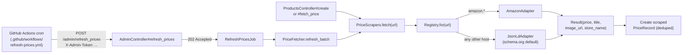

# Price Scrapers

This document describes how PriceTracker fetches prices from retailer
websites, how to add support for a new site, how the scheduler is configured
on Heroku, and what is known to work today.

---

## 1. Architecture at a glance



Three triggers, one core path:
- **A. Product creation** — synchronous, blocks the form submit. Lives in
  `ProductsController#create`. On failure the user can fall back to manual
  entry in the same form.
- **B. Manual "Fetch latest price" button** — synchronous, blocks the click.
  Lives in `ProductsController#fetch_price`.
- **C. GitHub Actions cron** — every 5 minutes during a 2-hour nightly
  window (UTC 7–8 ≈ 2:00–3:55 AM Chicago CDT). The workflow `curl`s
  `POST /admin/refresh_prices`; `AdminController` validates the token,
  enqueues `RefreshPricesJob`, and returns **202 Accepted** immediately.
  The job calls `PriceFetcher.refresh_batch` with a limit computed by
  [`RefreshSchedule`](../app/services/refresh_schedule.rb) from the current
  product count. See section 4 for setup.

Triggers A and B call `PriceFetcher.call` synchronously in the web request.
Trigger C is **async + batched** because Heroku web requests must finish
within 30 seconds — scraping thousands of products serially exceeds that.
Failures on individual products are caught and written to
`product.last_fetch_error`, never propagated to the user.

Why GitHub Actions instead of a Rails-internal scheduler?
- Free under the GitHub Student credit (no extra Heroku worker dyno).
- Schedule lives in version control (`.github/workflows/...`), not Heroku
  dashboard config.
- Platform-agnostic — only `APP_URL` would change if we migrated off Heroku.
- An Eco worker dyno would *sleep* alongside the web dyno when no traffic
  hits the app, which would silently break a Rails-internal cron.

---

## 2. The adapter contract

Every adapter inherits from `PriceScrapers::Base` and implements one method:

```ruby
def parse(doc, url)
  PriceScrapers::Result.new(
    price:      BigDecimal_or_nil,
    currency:   "USD",
    title:      String_or_nil,
    image_url:  String_or_nil,
    store_name: "Target",   # optional; Base falls back to host name
  )
end
```

`Base#fetch` handles HTTP, headers, error mapping, and helpers like
`#parse_price("$1,234.56") -> BigDecimal`. Subclasses only worry about
extracting fields from a `Nokogiri::HTML` document.

A `Result` with all-nil fields is *legal*: it represents "we could read the
page but found nothing useful." That just means no `PriceRecord` will be
created, but `last_fetched_at` still updates. The product page shows a
warning instead of crashing.

To raise a hard failure, throw one of:
- `PriceScrapers::TransientError` — try again next scheduler run (timeouts, 5xx)
- `PriceScrapers::PermanentError` — needs human attention (4xx, no recognizable shape)

Both are subclasses of `PriceScrapers::Error`, which the controllers and
`PriceFetcher` rescue.

---

## 3. Adding a new site

1. **Try the URL with the existing JSON-LD adapter first.** Most retailers
   already work because they emit schema.org Product data for SEO. Just add
   a product with the URL and click "Fetch latest price." If you get a real
   price, you're done — no code needed.

2. **If JSON-LD doesn't work**, write a site-specific adapter:

   ```ruby
   # app/services/price_scrapers/best_buy_adapter.rb
   module PriceScrapers
     class BestBuyAdapter < Base
       def parse(doc, _url)
         Result.new(
           price:     parse_price(doc.at_css(".priceView-customer-price span")&.text),
           title:     doc.at_css(".sku-title h1")&.text&.strip,
           image_url: doc.at_css(".primary-image")&.[]("src"),
           store_name: "Best Buy"
         )
       end
     end
   end
   ```

3. **Register it** in [`app/services/price_scrapers/registry.rb`][reg]:

   ```ruby
   ADAPTERS = [
     [ /(\A|\.)amazon\.[a-z.]+\z/,   AmazonAdapter ],
     [ /(\A|\.)bestbuy\.com\z/,      BestBuyAdapter ],
   ].freeze
   ```

4. **Add a fixture and test.** Save a real page snapshot to
   `test/fixtures/scrapers/best_buy.html` and write a test in
   `test/services/price_scrapers/best_buy_adapter_test.rb` that parses it
   without hitting the network.

[reg]: ../app/services/price_scrapers/registry.rb

---

## 4. Daily refresh via GitHub Actions cron

The schedule lives in
[`.github/workflows/refresh-prices.yml`](../.github/workflows/refresh-prices.yml).
It runs **every 5 minutes during UTC hours 7–8** (≈ 2:00–3:55 AM Chicago
CDT; use hours 8–9 UTC during CST) and `POST`s to `/admin/refresh_prices`,
authenticated with a shared secret in the `X-Admin-Token` header.

### 4.1 Request flow (one cron tick, end-to-end)

```
1. GitHub Actions runner spins up an Ubuntu container.
2. curl POST /admin/refresh_prices with X-Admin-Token.
3. Heroku router → Rails on the web dyno.
4. AdminController#refresh_prices:
     a. authenticate_admin_token! (secure_compare; fail-closed)
     b. create PriceRefreshRun (triggered_by from X-Trigger-Source header)
     c. RefreshPricesJob.perform_later(run.id)
     d. render 202 { ok, status: "enqueued", run_id, batch_size, runs_per_cycle }
5. curl sees HTTP 202 within ~1s; workflow polls GET /admin/refresh_runs/:id
   until the batch finishes (up to 3 minutes).

Meanwhile on the web dyno (async adapter):
6. RefreshPricesJob acquires a PostgreSQL advisory lock (skip if overlap).
7. limit = RefreshSchedule.batch_size
      (= ceil(scrapeable_product_count / runs_per_cycle); see Product.scrapeable)
8. PriceFetcher.refresh_batch(limit:, min_age: 23.hours)
      → only Product.scrapeable rows; stalest first; serial scrape; no sleep
      → write PriceRecord only if price changed (dedup)
9. Update PriceRefreshRun with summary; log { total, attempted, succeeded,
      failed, stale_remaining, duration, failures[] }
10. GitHub Actions writes a markdown report to the run **Summary** tab.
```

Over 24 ticks in the 2-hour window, the full **scrapeable** catalog is
covered. When scrapeable product count doubles, `batch_size` doubles
automatically — no code deploy required.

### 4.1a Which products enter a refresh batch (`Product.refreshable`)

Cron and manual refresh use **`Product.refreshable`**, not every row with a
`source_url`:

| Included | Excluded |
|---|---|
| Real team/user products with PDP URLs | `paginationtest@example.com` (Pagy UI volume only) |
| Passes `Product.scrapeable` checks | `example.com`, `/search?` placeholders |

Implementation: [`Product.refreshable`](../app/models/product.rb). On production
this is typically **~15 real products**, not 1,265 pagination rows.

**Manual Run workflow** sends `X-Refresh-Mode: full-cycle` — one job runs batch
after batch **immediately** (no 5-minute gap) until `stale_remaining` is zero.

**Nightly cron** sends `X-Refresh-Mode: batch` — one batch per 5-minute tick.

### 4.1b Seed & load-test data (real PDP URLs)

Local and CI seeds ([`db/seeds.rb`](../db/seeds.rb)) pull from
[`db/seeds/real_product_catalog.rb`](../db/seeds/real_product_catalog.rb) — 49
unique retailer PDP links (Amazon, Best Buy, Walmart, Lululemon, etc.), cycled to
 exceed 1,000 products for Pagy stress tests.

**Production:** do **not** run `db:seed:replant` on Heroku (destroys real users).
To replace only the pagination account:

```bash
heroku run bin/rails paginationtest:reseed_real_urls -a smart-shoppinglist
```

See [`lib/tasks/paginationtest.rake`](../lib/tasks/paginationtest.rake). Team members'
manually tracked products are never touched.

### 4.1c Batch observability (`price_refresh_runs` + Actions Summary)

Each cron/manual trigger creates a [`PriceRefreshRun`](../app/models/price_refresh_run.rb)
row (status, attempted/succeeded/failed counts, duration, JSON failure details).
Admin poll endpoint: `GET /admin/refresh_runs/:id` (same `X-Admin-Token`).

The GitHub workflow writes a human-readable report to the run **Summary** tab.
Interpreting results:

- **HTTP 202** on POST = job enqueued, not finished.
- **Succeeded / Failed** = per-product scrape outcomes in that batch (403, missing
  JSON-LD, and timeouts are common on Heroku cloud IPs — not necessarily bugs).
- **Workflow red + "did not finish within 3 minutes"** — poll timed out; the batch
  may still complete on Heroku. Check the latest `PriceRefreshRun` or re-open Summary
  after the job finishes (~3 min for a full batch of ~53 serial scrapes).

`PriceFetcher.refresh_all` remains available for CLI/emergency use:
`bin/rails runner "PriceFetcher.refresh_all"`.

Per-product failures (timeout, 403, parse error) are caught in
`PriceFetcher.call` and stored on `last_fetch_error`. The workflow stays
green when the batch completes; it fails only on job crash or poll timeout.
Individual scrape failures appear in the run Summary.

### 4.2 Tuning (ENV vars on Heroku)

| Variable | Default | Purpose |
|---|---|---|
| `REFRESH_WINDOW_HOURS` | 2 | Target hours to cover full catalog |
| `REFRESH_INTERVAL_MINUTES` | 5 | Cron cadence inside the window |
| `REFRESH_STALE_HOURS` | 23 | Skip products fetched more recently |
| `REFRESH_BATCH_MAX` | 500 | Safety cap per batch |

### 4.3 One-time setup

1. **Generate a strong shared secret:**
   ```bash
   TOKEN=$(openssl rand -hex 32)
   ```

2. **Set it on Heroku** (the app reads it from `ENV["ADMIN_REFRESH_TOKEN"]`):
   ```bash
   heroku config:set ADMIN_REFRESH_TOKEN="$TOKEN" -a smart-shoppinglist
   ```

3. **Add two GitHub repo secrets** at
   *Settings → Secrets and variables → Actions → New repository secret*:

   | Name | Value |
   |---|---|
   | `APP_URL` | `https://smart-shoppinglist-6ae31171e85c.herokuapp.com` |
   | `ADMIN_REFRESH_TOKEN` | the same `$TOKEN` value as on Heroku |

4. **Verify by manually triggering a run.** GitHub repo → *Actions* tab →
   *Daily price refresh* → *Run workflow*. Open the run → **Summary** tab
   for the batch report (attempted / succeeded / failed / duration / failure
   list). Heroku logs remain available for deep debugging:
   `heroku logs --tail -a smart-shoppinglist`.

### 4.4 Scaling path (L2+)

The cron path uses Rails' `:async` adapter on the web dyno (no worker
required). When product count grows beyond what one dyno can scrape in the
window, upgrade to Solid Queue + a worker dyno — `RefreshPricesJob` and
`PriceFetcher.call` stay unchanged; only infrastructure and ENV change.

### 4.5 Cost

- **GitHub Actions:** free under the GitHub Student credit. Each tick polls
  for up to ~3 minutes while the batch runs. 24 ticks/night ≈ ~72 minutes/night.
- **Heroku:** zero additional cost beyond the existing `Eco web $5 + Mini
  Postgres $5 = $10/month`. No worker dyno, no Scheduler add-on, no
  one-off dyno hours consumed.
- **Total monthly bill:** unchanged at **$10**, well inside the
  `$13/month` GitHub Student credit on Heroku.

---

## 5. Pricing dedup, idempotence, and what scrapers will not touch

`PriceFetcher.call(product)` is safe to invoke at any frequency:

- A new `PriceRecord(source: "scraped")` is written **only** when the
  fetched price differs from the last scraped record. Repeated identical
  prices update `last_fetched_at` but do not pollute price history.
- It **never mutates** `product.name`, `product.image_url`,
  `product.description`, or `product.category`. Those are populated only
  during product creation in [`ProductsController#create`][pc] and stay
  user-controlled afterwards.
- Manual price records (`source: "manual"`) are never deleted or modified.
- Products without a `source_url` are completely ignored — backwards-
  compatibility for any pre-existing manual-only products.

[pc]: ../app/controllers/products_controller.rb

---

## 6. Site support: what works today

This is a best-effort prediction; verify by trying a real URL and looking
at `product.last_fetch_error`.

### A — Generic adapter (`JsonLdAdapter`) is expected to work

Most large retailers publish schema.org `Product` JSON-LD because Google's
Rich Results require it. The same parser handles all of these.

| Site | Why it should work |
|---|---|
| Best Buy | Standard JSON-LD |
| Newegg | Standard JSON-LD |
| Apple Store | Standard JSON-LD |
| B&H Photo | Standard JSON-LD |
| Walmart (PDP) | Standard JSON-LD |
| Costco | Standard JSON-LD |
| Home Depot | Standard JSON-LD |
| Lowe's | Standard JSON-LD |
| Etsy | Standard JSON-LD |
| IKEA | Standard JSON-LD |
| Nike, Adidas | Standard JSON-LD |
| Lululemon | Salesforce Commerce default |
| Macy's, Nordstrom, REI | Standard JSON-LD |

### B — Has its own adapter

| Site | Adapter | Why custom |
|---|---|---|
| Amazon | `AmazonAdapter` | Inconsistent JSON-LD; uses `#corePriceDisplay_desktop_feature_div .a-offscreen` and similar fallbacks. Aggressive bot detection, but our usage volume is well below their thresholds. |

### C — Likely to need work

| Site | Issue |
|---|---|
| ZARA, H&M | Some pages render price asynchronously after the initial GET (no SSR for price). |
| Small DTC brands on bespoke stacks | Hit-or-miss; many are on Shopify and emit JSON-LD by default, but custom themes may strip it. |

### D — Not feasible without a different approach

These sites are **known blockers**. Hitting one of them is not a bug in our
scraper — it is a deliberate design decision by the retailer that no plain
HTTP client (Ruby, curl, Python `requests`, etc.) can defeat.

| Category | What it looks like | Why we cannot bypass it | Confirmed examples |
|---|---|---|---|
| **Cloudflare Bot Management** | First request returns HTTP 403 with response headers `cf-mitigated: challenge` and a `__cf_bm` cookie. The body is a JavaScript challenge page from `challenges.cloudflare.com`, not the real product. | The challenge requires executing JavaScript in a real browser to compute a token, then re-requesting with the resulting cookie. HTTParty does not run JavaScript, and TLS fingerprinting (JA3) flags Ruby clients regardless of headers. | Alo Yoga, Nordstrom, Sephora, ASOS |
| **Akamai Bot Manager (strict mode)** | HTTP 403 or an Akamai sensor-data challenge page; sometimes redirects to a `_abck` cookie set page. | Same root cause as Cloudflare: requires a full browser environment to execute the sensor JS. | Footlocker (some pages), some Nike releases |
| **PerimeterX / HUMAN Security (IP-reputation tier)** | HTTP 403 with a `_pxhd` (or `_px`) cookie set, sometimes accompanied by `RTSS` / `rtss1` headers. The body is either an empty PX challenge page or a generic `<html>403</html>`. **Crucially: this often returns success from a residential IP and 403 from a cloud IP** — it's not deterministic. | PX scores every request against an IP reputation database. Heroku / AWS / GCP IP ranges are pre-flagged as "datacenter, likely bot" and blocked even with a perfect User-Agent. There is no client-side workaround. | Free People, Urban Outfitters, Anthropologie (all on the URBN platform) |
| **Login / membership wall** | HTML loads, but price markup is replaced with "Sign in to see price." | Requires authenticated session cookies we don't have. | Costco (some categories) |
| **Variant required for price** | Page renders without a price; user must pick size/color first via JS. | Initial SSR HTML genuinely contains no price — there is nothing to scrape. | Some apparel PDPs |
| **Pure client-side rendering** | The HTML is essentially an empty `<div id="root">`; everything is fetched and rendered by React/Vue after page load. | Headless browser (Playwright) needed; out of scope on a single Heroku Eco dyno. | Some smaller DTC sites |
| **Target (CSR rollout, ~Apr 2026)** | Returns HTTP 200 with a complete-looking HTML page, but contains zero `application/ld+json` scripts. The Next.js `__NEXT_DATA__` blob explicitly carries `pageProps.isProductDetailServerSideRenderPriceEnabled: false`. The price is fetched after hydration via `redsky.target.com/redsky_aggregations/...`. | Target rolled this server-side-render-disable flag out globally just before Milestone 1; their HTML now contains no price field at all to scrape. Reverse-engineering the redsky GraphQL endpoint is feasible (it requires a hard-coded `x-api-key` they ship in their JS bundle) but is brittle and out of scope. | All `target.com/p/...` PDPs |
| **API gated by OAuth / paid keys** | Public HTML pages exist, but the canonical price comes from an authenticated API. | Requires obtaining and rotating API credentials. | eBay's modern catalog API |

If a customer of the app really needs one of these sites, the realistic
options are (a) integrate a paid scraping service such as ScraperAPI,
ZenRows, or Bright Data, which solve Cloudflare/Akamai challenges on their
infrastructure, or (b) provision a Playwright-based dyno separate from web —
both are out of scope for this milestone.

---

## 7. Legal & ethical notes

- Amazon's Terms of Service prohibit scraping. Our usage in this project
  (a handful of products refreshed at most hourly) is well below any
  threshold that might draw attention, but at scale you should switch to
  Amazon's official Product Advertising API.
- For other retailers, observe `robots.txt` if you significantly increase
  frequency. The included `sleep 1` between requests in
  `PriceFetcher.refresh_all` keeps us polite by default.
- Scraped prices may not reflect taxes, shipping, member discounts, or
  region-specific pricing. Treat them as informational, not authoritative.

---

## 8. Troubleshooting

**Symptom**: Product page shows
"Last refresh failed: HTTP 503 from www.example.com"
**Cause**: Site rate-limited us or had an outage.
**Fix**: Wait, click "Fetch latest price" again. If it persists for a
specific site, write a custom adapter or back off the cron frequency.

**Symptom**: Product was added but price column is empty.
**Cause**: The page either had no JSON-LD Product or our parser couldn't
locate the price (e.g. Walmart sometimes shows a price *range* without a
flat `offers.price`).
**Fix**: Add a manual price record, or write a site adapter.

**Symptom**: `No schema.org Product JSON-LD found` from a `target.com/p/...`
URL even though the page loads in a browser.
**Cause**: As of late April 2026 Target globally disabled server-side
rendering of price (`isProductDetailServerSideRenderPriceEnabled: false`
in their Next.js page props) and now fetches the price client-side from
`redsky.target.com`. Our HTML scrape genuinely has nothing to extract.
**Fix**: There is no quick fix — the price is no longer in the HTML. See
Section 6.D for the full picture. For now, prefer Best Buy / Walmart for
similar product categories, or add the price to the Target product
manually.

**Symptom**: "Couldn't read that URL" on product creation.
**Cause**: 5-second timeout exceeded, or hard 4xx from the site.
**Fix**: Try again, try a different URL, or add the product manually
(temporarily put a placeholder URL or just skip auto-fetch by editing
post-create).

**Symptom**: `HTTP 403 from <host>` on a major brand site (e.g. Alo Yoga,
Nordstrom, Sephora, Free People).
**Cause**: The site is behind Cloudflare Bot Management, Akamai Bot
Manager, or PerimeterX / HUMAN Security and is serving a challenge instead
of the product page. You can confirm with `curl -I <url>` and look at the
response cookies / headers:
- `__cf_bm` cookie or `cf-mitigated: challenge` header → Cloudflare
- `_abck` cookie or `ak_bmsc` cookie → Akamai
- `_pxhd` / `_px*` cookie or `RTSS` header → PerimeterX
**Fix**: This is not a bug; see Section 6.D for the design rationale and
the list of options for supporting these sites (paid scraping APIs or a
headless-browser dyno). For now, prefer a different retailer for that
product, or fall back to manual price entry.

**Symptom**: A URL that just worked locally returns 403 once deployed to
Heroku.
**Cause**: PerimeterX-style protections (Free People, Urban Outfitters,
Anthropologie, etc.) use IP reputation scoring. Heroku's IP ranges are
flagged as datacenter traffic, so production refreshes can fail even when
the same URL works fine in local development. This is by design on the
retailer's side, not a regression.
**Fix**: Same as above — for blocked sites, use a different retailer or
add prices manually. Do not chase this with new headers; it cannot be
fixed without changing IP, which means proxying through a paid scraping
service.
