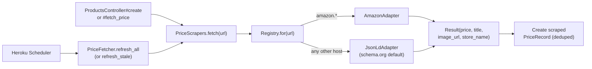

# Price Scrapers

This document describes how PriceTracker fetches prices from retailer
websites, how to add support for a new site, how the scheduler is configured
on Heroku, and what is known to work today.

---

## 1. Architecture at a glance



Three triggers, one core path:
- **B. Product creation** (synchronous, blocks the form submit)
- **A. Manual "Fetch latest price" button** (synchronous, blocks the click)
- **C. Heroku Scheduler** (off-process daily/hourly cron)

There is no Solid Queue, no worker dyno, and no `FetchPriceJob` — every
"trigger" calls into `PriceFetcher.call` directly. Failures are caught and
written to `product.last_fetch_error`, never propagated to the user.

---

## 2. The adapter contract

Every adapter inherits from `PriceScrapers::Base` and implements one method:

```ruby
def parse(doc, url)
  PriceScrapers::Result.new(
    price:      BigDecimal_or_nil,
    currency:   "USD",
    title:      String_or_nil,
    image_url:  String_or_nil,
    store_name: "Target",   # optional; Base falls back to host name
  )
end
```

`Base#fetch` handles HTTP, headers, error mapping, and helpers like
`#parse_price("$1,234.56") -> BigDecimal`. Subclasses only worry about
extracting fields from a `Nokogiri::HTML` document.

A `Result` with all-nil fields is *legal*: it represents "we could read the
page but found nothing useful." That just means no `PriceRecord` will be
created, but `last_fetched_at` still updates. The product page shows a
warning instead of crashing.

To raise a hard failure, throw one of:
- `PriceScrapers::TransientError` — try again next scheduler run (timeouts, 5xx)
- `PriceScrapers::PermanentError` — needs human attention (4xx, no recognizable shape)

Both are subclasses of `PriceScrapers::Error`, which the controllers and
`PriceFetcher` rescue.

---

## 3. Adding a new site

1. **Try the URL with the existing JSON-LD adapter first.** Most retailers
   already work because they emit schema.org Product data for SEO. Just add
   a product with the URL and click "Fetch latest price." If you get a real
   price, you're done — no code needed.

2. **If JSON-LD doesn't work**, write a site-specific adapter:

   ```ruby
   # app/services/price_scrapers/best_buy_adapter.rb
   module PriceScrapers
     class BestBuyAdapter < Base
       def parse(doc, _url)
         Result.new(
           price:     parse_price(doc.at_css(".priceView-customer-price span")&.text),
           title:     doc.at_css(".sku-title h1")&.text&.strip,
           image_url: doc.at_css(".primary-image")&.[]("src"),
           store_name: "Best Buy"
         )
       end
     end
   end
   ```

3. **Register it** in [`app/services/price_scrapers/registry.rb`][reg]:

   ```ruby
   ADAPTERS = [
     [ /(\A|\.)amazon\.[a-z.]+\z/,   AmazonAdapter ],
     [ /(\A|\.)bestbuy\.com\z/,      BestBuyAdapter ],
   ].freeze
   ```

4. **Add a fixture and test.** Save a real page snapshot to
   `test/fixtures/scrapers/best_buy.html` and write a test in
   `test/services/price_scrapers/best_buy_adapter_test.rb` that parses it
   without hitting the network.

[reg]: ../app/services/price_scrapers/registry.rb

---

## 4. Heroku Scheduler configuration (one-time, in dashboard)

The scheduler runs the same `PriceFetcher` code, just without a user
attached. There is **no commit** required to enable it; everything lives
in the Heroku dashboard.

1. **Provision the add-on** (free):

   ```bash
   heroku addons:create scheduler:standard --app smart-shoppinglist
   ```

   Or in the dashboard: **Resources → Add-ons → search "Heroku Scheduler" → Provision**.

2. **Open Scheduler**:

   ```bash
   heroku addons:open scheduler --app smart-shoppinglist
   ```

3. **Add a Job**:
   - **Schedule**: `Every day at 09:00 UTC` (or hourly if you want a richer demo)
   - **Run Command**: `bin/rails runner "PriceFetcher.refresh_all"`
   - **Dyno Size**: `Eco` (this is a temporary one-off dyno)

4. **Save**.

### When to switch from `refresh_all` to `refresh_stale`

- **Few products, low frequency (default):** `refresh_all` — re-checks every product on every run.
- **Many products, high frequency:** `refresh_stale` — only re-checks products whose `last_fetched_at` is older than 2 days, avoiding waste.

Change the command in the Scheduler dashboard; no code change needed.

### Cost

`Heroku Scheduler` is free. The one-off dyno it spawns counts against your
Eco dyno hours (1000/month shared). For 5 products refreshed daily:
~7.5 minutes of dyno-hours per month — negligible. Even hourly is ~3 hours
per month, well within budget. The total monthly bill stays at **$10**
(`Eco web $5 + Mini Postgres $5`).

---

## 5. Pricing dedup, idempotence, and what scrapers will not touch

`PriceFetcher.call(product)` is safe to invoke at any frequency:

- A new `PriceRecord(source: "scraped")` is written **only** when the
  fetched price differs from the last scraped record. Repeated identical
  prices update `last_fetched_at` but do not pollute price history.
- It **never mutates** `product.name`, `product.image_url`,
  `product.description`, or `product.category`. Those are populated only
  during product creation in [`ProductsController#create`][pc] and stay
  user-controlled afterwards.
- Manual price records (`source: "manual"`) are never deleted or modified.
- Products without a `source_url` are completely ignored — backwards-
  compatibility for any pre-existing manual-only products.

[pc]: ../app/controllers/products_controller.rb

---

## 6. Site support: what works today

This is a best-effort prediction; verify by trying a real URL and looking
at `product.last_fetch_error`.

### A — Generic adapter (`JsonLdAdapter`) is expected to work

Most large retailers publish schema.org `Product` JSON-LD because Google's
Rich Results require it. The same parser handles all of these.

| Site | Why it should work |
|---|---|
| Best Buy | Standard JSON-LD |
| Target | Standard JSON-LD |
| Newegg | Standard JSON-LD |
| Apple Store | Standard JSON-LD |
| B&H Photo | Standard JSON-LD |
| Walmart (PDP) | Standard JSON-LD |
| Costco | Standard JSON-LD |
| Home Depot | Standard JSON-LD |
| Lowe's | Standard JSON-LD |
| Etsy | Standard JSON-LD |
| IKEA | Standard JSON-LD |
| Nike, Adidas | Standard JSON-LD |
| Lululemon | Salesforce Commerce default |
| Macy's, Nordstrom, REI | Standard JSON-LD |

### B — Has its own adapter

| Site | Adapter | Why custom |
|---|---|---|
| Amazon | `AmazonAdapter` | Inconsistent JSON-LD; uses `#corePriceDisplay_desktop_feature_div .a-offscreen` and similar fallbacks. Aggressive bot detection, but our usage volume is well below their thresholds. |

### C — Likely to need work

| Site | Issue |
|---|---|
| ZARA, H&M | Some pages render price asynchronously after the initial GET (no SSR for price). |
| Small DTC brands on bespoke stacks | Hit-or-miss; many are on Shopify and emit JSON-LD by default, but custom themes may strip it. |

### D — Not feasible without a different approach

- Sites that gate prices behind login or membership.
- Sites that require selecting a variant (size/color) before a price appears.
- Sites that rely entirely on client-side rendering with no SSR
  (would need a headless browser like Playwright, out of scope).
- APIs that require OAuth/keys (e.g. eBay's modern catalog API).

---

## 7. Legal & ethical notes

- Amazon's Terms of Service prohibit scraping. Our usage in this project
  (a handful of products refreshed at most hourly) is well below any
  threshold that might draw attention, but at scale you should switch to
  Amazon's official Product Advertising API.
- For other retailers, observe `robots.txt` if you significantly increase
  frequency. The included `sleep 1` between requests in
  `PriceFetcher.refresh_all` keeps us polite by default.
- Scraped prices may not reflect taxes, shipping, member discounts, or
  region-specific pricing. Treat them as informational, not authoritative.

---

## 8. Troubleshooting

**Symptom**: Product page shows
"Last refresh failed: HTTP 503 from www.example.com"
**Cause**: Site rate-limited us or had an outage.
**Fix**: Wait, click "Fetch latest price" again. If it persists for a
specific site, write a custom adapter or back off the cron frequency.

**Symptom**: Product was added but price column is empty.
**Cause**: The page either had no JSON-LD Product or our parser couldn't
locate the price (e.g. Walmart sometimes shows a price *range* without a
flat `offers.price`).
**Fix**: Add a manual price record, or write a site adapter.

**Symptom**: "Couldn't read that URL" on product creation.
**Cause**: 5-second timeout exceeded, or hard 4xx from the site.
**Fix**: Try again, try a different URL, or add the product manually
(temporarily put a placeholder URL or just skip auto-fetch by editing
post-create).
